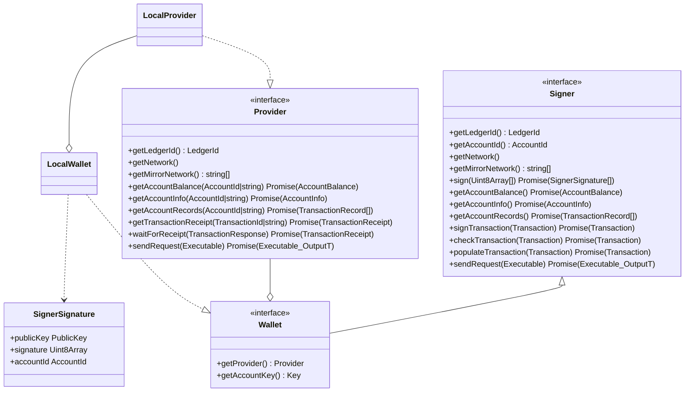
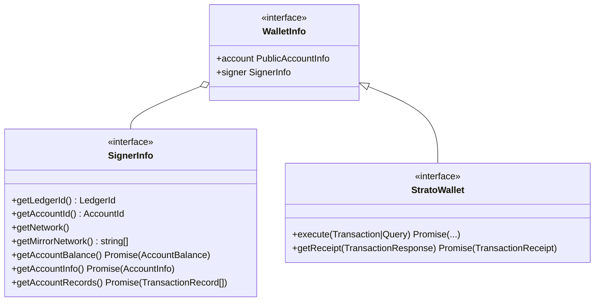

import { HeadStarterConnectWallet } from '@site/src/components/ConnectWallet';

## [HIP-338](https://hips.hedera.com/hip/hip-338) compliant
We might be the first library to support Hedera's standardised wallet proposal and we're damn proud of it.

Want to give it a spin? Make sure you have [HashPack installed](https://www.hashpack.app/) and then connect to the docs page by clicking 
<HeadStarterConnectWallet />

Then get a hold of [a Session that targets a `Browser` wallet](../configuration.md#HEDERAS_WALLET_TYPE) and use it normally:
```js live
const { session } = await ApiSession.default({ wallet: { type: 'Browser' } });
const liveJson = await session.upload(new Json({ theAnswer: 42 }));

console.log(`Wallet account id used: ${session.wallet.account.id.toString()}`);
console.log(`Json is stored at ${liveJson.id.toString()}`);
console.log(`The answer is: ${liveJson.theAnswer}`);
```

## Under the hood
### Hedera's [SDK implementation](https://github.com/hashgraph/hedera-sdk-js/pull/960)mersi Ș-



### Strato's take
:::caution
This feature is currently in active development. As such, it is verry likely that the final API, once the stable release hits the streets, will differ.
:::

