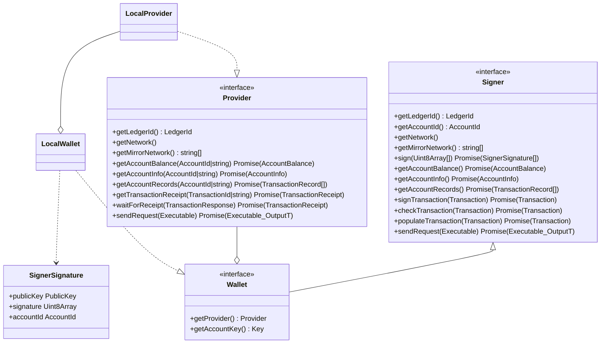
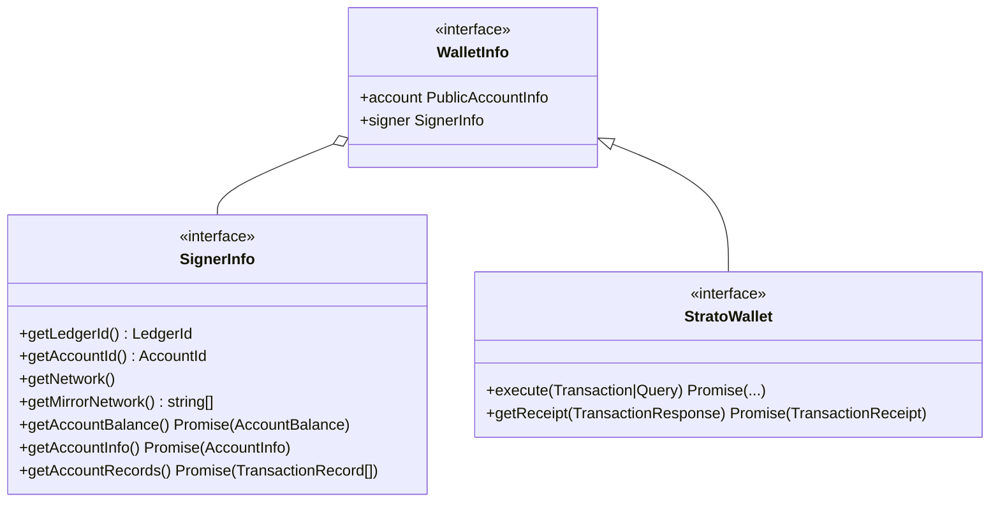

## HIP-338 compliant
TODO

```mermaid
 classDiagram
  direction TB

  LocalProvider --o LocalWallet
  LocalProvider ..|> Provider
  Signer <|-- Wallet
  LocalWallet ..> SignerSignature
  LocalWallet ..|> Wallet
  Provider --o Wallet

  class Provider {
    <<interface>>
    +getLedgerId() LedgerId
    +getNetwork()
    +getMirrorNetwork() string[]
    +getAccountBalance(AccountId|string) Promise(AccountBalance)
    +getAccountInfo(AccountId|string) Promise(AccountInfo)
    +getAccountRecords(AccountId|string) Promise(TransactionRecord[])
    +getTransactionReceipt(TransactionId|string) Promise(TransactionReceipt)
    +waitForReceipt(TransactionResponse) Promise(TransactionReceipt)
    +sendRequest(Executable) Promise(Executable_OutputT)
  }

  class SignerSignature {
    +publicKey PublicKey
    +signature Uint8Array
    +accountId AccountId
  }

  class Signer {
    <<interface>>
    +getLedgerId() LedgerId
    +getAccountId() AccountId
    +getNetwork()
    +getMirrorNetwork() string[]
    +sign(Uint8Array[]) Promise(SignerSignature[])
    +getAccountBalance() Promise(AccountBalance)
    +getAccountInfo() Promise(AccountInfo)
    +getAccountRecords() Promise(TransactionRecord[])
    +signTransaction(Transaction) Promise(Transaction)
    +checkTransaction(Transaction) Promise(Transaction)
    +populateTransaction(Transaction) Promise(Transaction)
    +sendRequest(Executable) Promise(Executable_OutputT)
  }

  class Wallet {
    <<interface>>
    +getProvider() Provider
    +getAccountKey() Key
  }

  class LocalProvider {
    
  }

  class LocalWallet {

  }
```

## Strato's take

```mermaid
 classDiagram
  direction TB

  WalletInfo o-- SignerInfo
  WalletInfo <|-- StratoWallet

  class SignerInfo {
    <<interface>>
    +getLedgerId() LedgerId
    +getAccountId() AccountId
    +getNetwork()
    +getMirrorNetwork() string[]
    +getAccountBalance() Promise(AccountBalance)
    +getAccountInfo() Promise(AccountInfo)
    +getAccountRecords() Promise(TransactionRecord[])
  }

  class WalletInfo {
    <<interface>>
    +account PublicAccountInfo
    +signer SignerInfo
  }

  class StratoWallet {
    <<interface>>
    +execute(Transaction|Query) Promise(...)
    +getReceipt(TransactionResponse) Promise(TransactionReceipt)
  }
```