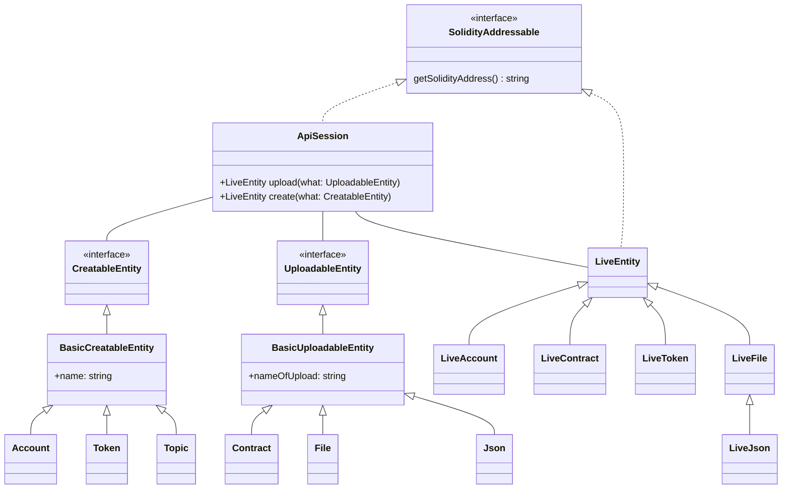

## Installing

Your normal

```bash npm2yarn
npm install @buidlerlabs/hedera-strato-js
```

will suffice.

## Hello Strato

As we've seen in our introductory page, firing up your first Strato smart-contract example should be straight forward but let's kick it up a notch to make things a little more interesting. Suppose you have a trimmed down version (comments & `dec` method stripped) of [the following contract](https://solidity-by-example.org/first-app/):

```sol title="./increment.sol"
// SPDX-License-Identifier: MIT
pragma solidity ^0.8.9;

contract Counter {
  uint public count;

  function get() public view returns (uint) {
    return count;
  }

  function inc() public {
    count += 1;
  }
}
```

Instead of having a value that we read from the contract, we have state-mutating methods and a way to query the inner state which is much closer to production scenarios and, therefore, much more useful for our learning journey.

Interacting with it via Strato could be as simple as:

```js live=true containerKey=increment_from_path
const { session } = await ApiSession.default();
const counterContract = await Contract.newFrom({ path: "./increment.sol" });
const liveContract = await session.upload(counterContract);

// Increment then retrieve the counter
await liveContract.inc();
console.log(await liveContract.get());
```

:::note
We need the `.toNumber` call since the returned value of calling the `get` method is an `uint` which [maps to a `BigNumber`](https://mikemcl.github.io/bignumber.js/) and `console.log` does not know how to display such instances.
:::

By convention, when calling `Contract.newFrom` passing it a `path`, Strato expects to find the solidity contract code in the `contracts` folder. This is configurable via the `HEDERAS_CONTRACTS_RELATIVE_PATH` environment variable.

If you were to run this code snippet, you would end up with a complaint issued by `ApiSession.default` saying something about a network not available issue. That's because Strato does not know, out of the box, to which network you want to connect.

We'll discuss configuration aspects in the upcoming page, but for now, to make this running, just create a `.env` file in your project root directory and have the following values defined:

```
HEDERAS_NETWORK=testnet
HEDERAS_OPERATOR_ID=0.0...
HEDERAS_OPERATOR_KEY=302e02...
```

<details>
  <summary>Further notes on the <code>.env</code> config used by the code present in the <code>Live Editor</code> boxes</summary>
  Together with the above mentioned credentials, the following options have been overwritten/defined:

```
  HEDERAS_DEFAULT_CONTRACT_REQUESTS_RETURN_ONLY_RECEIPTS=false
  HEDERAS_DEFAULT_PAYMENT_FOR_CONTRACT_QUERY=1000000
  HEDERAS_LOGGER_LEVEL=debug
  HEDERAS_LOGGER_ENABLED=true
```

You can head over to [the config page](./configuration.md) for a detailed explanation of what these (along with other) settings translate to.

</details>

Make sure to replace the values as you see fit:

- `HEDERAS_NETWORK` : can be either one of the official networks (`previewnet`, `testnet` or `mainnet`) or, for a more close-tight experience, `customnet`
- `HEDERAS_OPERATOR_ID` and `HEDERAS_OPERATOR_KEY` are the operator's account id and private key which will pay for the transactions.

If you don't have a pair of operator credentials, you can create a `testnet`/`previewnet` account for free if you register on the [Hedera Portal](https://portal.hedera.com/register).

Having the `.env` file available with the required values is enough to allow for successfully re-running the above example.

:::tip
If working locally and want to see a bit more console activity of what's happening underneath the hood, you can enable the logger and setup a sensible threshold by also adding to `.env` the following values:

```
HEDERAS_LOGGER_LEVEL=debug
HEDERAS_LOGGER_ENABLED=true
```

:::

## Architecture

Before we move on, it's worth talking here a bit about Strato's envisioned design:



:::info
This is just a high level overview that helps arguing the library architecture decisions for most of the developer use-cases. It is, by no means, complete. More sophisticated entities such as [the `StratoWallet` interface](https://github.com/buidler-labs/hedera-strato-js/tree/main/lib/core/wallet) (which helps configure the underlying network layer aiding [the wallet bridge](./guides//wallet.md) in the process) have been excluded from the diagram.

This has been done both to conserve pixels and due to the fact that those entities are still in development.
:::

Basically, we tried to walk away from the _builder_ feel given by working with the official Hedera SDK and move towards a more _mapping_ kind of approach which, hopefully, should be more familiar to how Object Oriented Programing solutions are thought. This means that, instead of having

```js
new FileCreateTransaction()
  .setKeys([client.operatorPublicKey])
  .setContents(contractByteCode)
  .execute(client);
```

we tweaked and reversed the execution to have

```js
session.upload(contract);
```

which would better approximate the mechanics of

```
instance = session.newInstance(class)
```

with `instance` being the `live`, hedera-deployed, runtime object and `class` being the blueprint of whatever needs to be constructed on the network (eg. `Token` or `Contract`).

Having said that, depending on the Hedera targeted service, there are 2 types of entities in the library:

- static entities - which are further down differentiable into `CreatableEntity`s and `UploadableEntity`s
- live entities - which are the "resulting instances" of having the _static entities_ deployed

## Next up

Now that we've discussed a bit about installing and running some Strato code as well as the overall design vision of the library, it's high time we have a look at configuring/customizing a runtime `ApiSession`.
